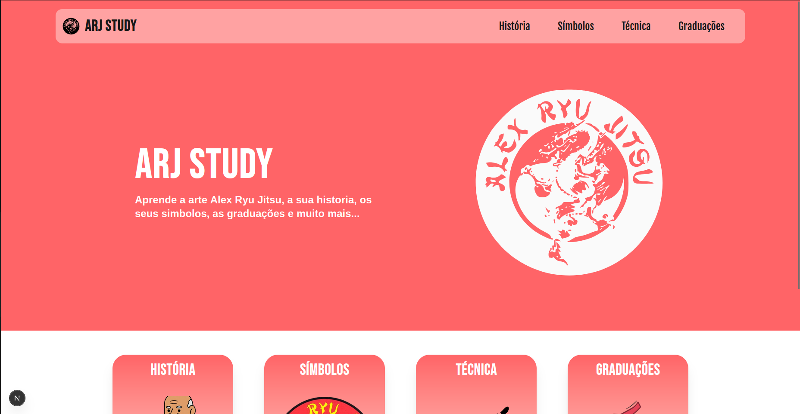

# ARJStudy

**ARJStudy** is a static website created to learn and explore the martial art **Alex Ryu Jitsu (ARJ)**.  
Here you'll find its **history**, the **meaning of its symbols**, and even the **techniques** practiced in this discipline.

Whether you're a student, practitioner, or just curious, this site is made to help deepen your understanding of ARJ.  
Feel free to run it and explore!

This is a [Next.js](https://nextjs.org) project bootstrapped with [`create-next-app`](https://nextjs.org/docs/pages/api-reference/create-next-app).

---

## 🖼️ Preview




---

## 🧠 Features

- 📜 History of Alex Ryu Jitsu  
- 🧩 Explanation of symbols and their meaning  
- 🥋 List of techniques
- ⭐️ List of graduations
- ⚡ Fast and lightweight (static generation)

---

## 🚀 Getting Started

First, install the dependencies:

```bash
npm install
# or
yarn install
# or
pnpm install
# or
bun install
```

Then, run the development server:

```bash
npm run dev
# or
yarn dev
# or
pnpm dev
# or
bun dev
```
Open http://localhost:3000 in your browser to view the website.

---

## 🔧 Technologies Used

- React
- Next.js
- Tailwind

